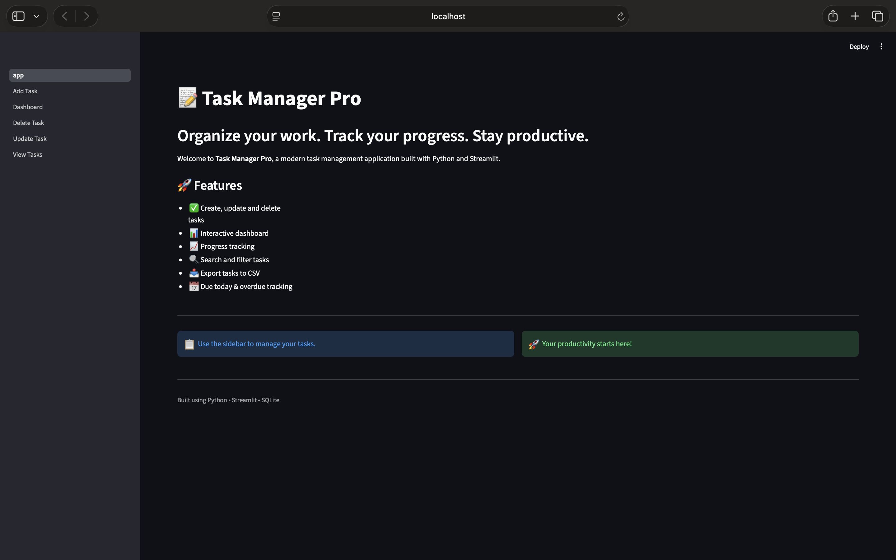
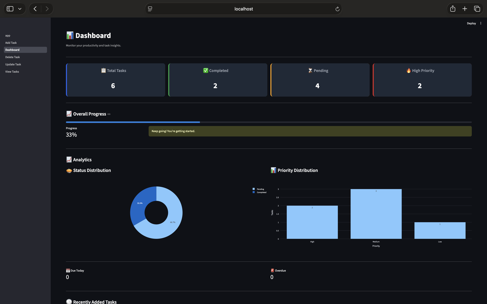
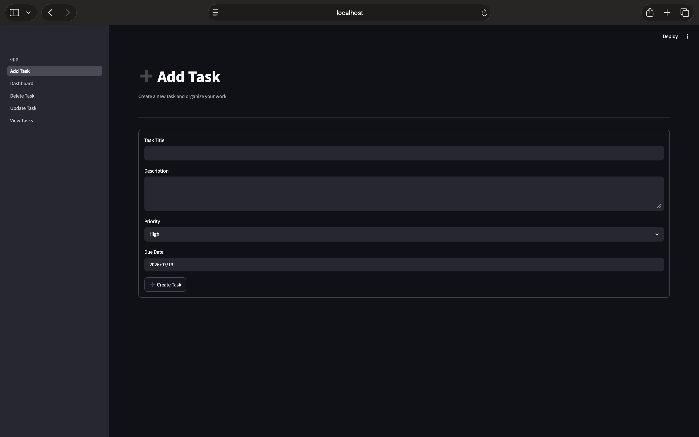
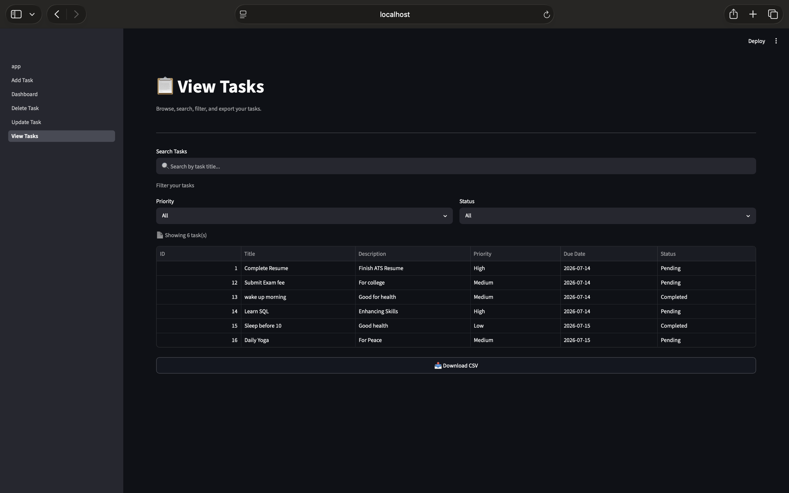
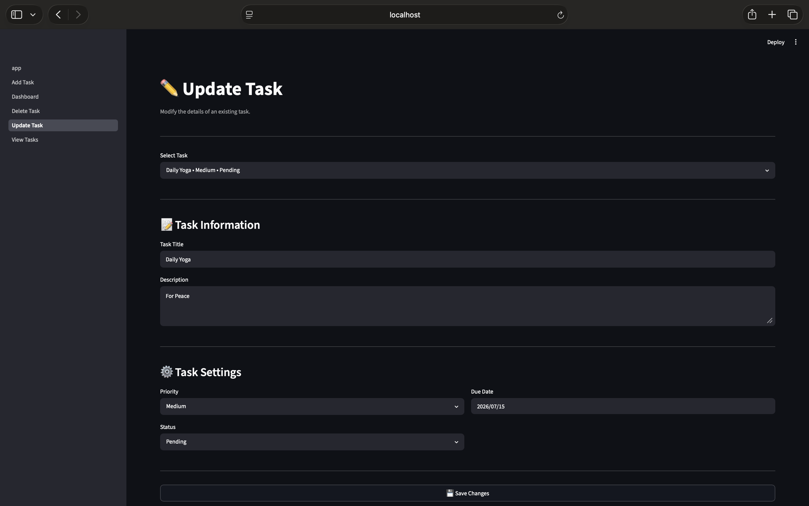
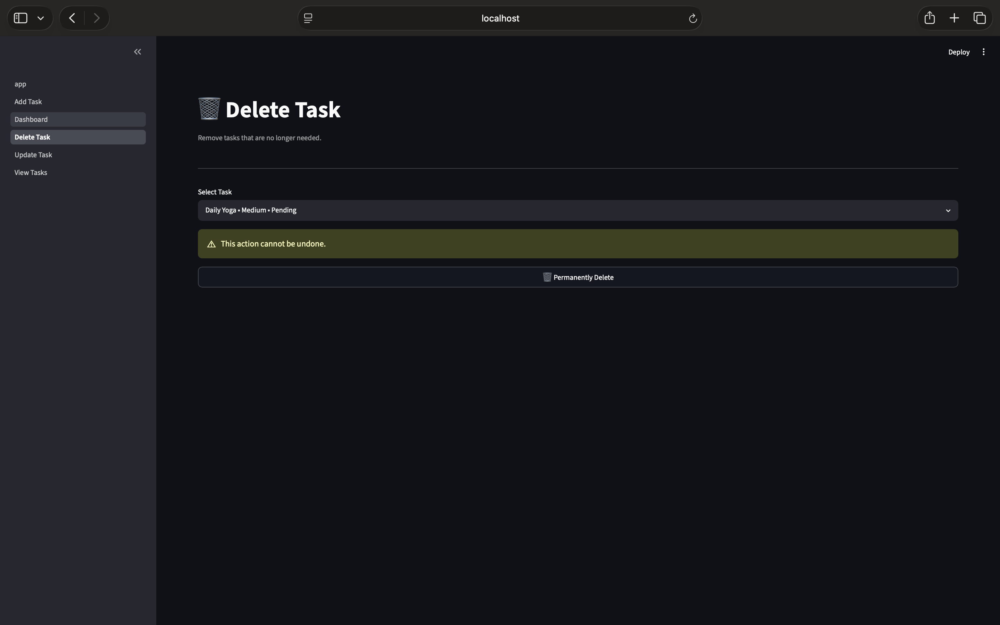

# 📝 Task Manager Pro

A modern **Task Management System** built with **Python, Streamlit, SQLite, Pandas, and Plotly**.

This application helps users efficiently manage their daily tasks by providing task creation, updating, deletion, progress tracking, analytics, search, filtering, and CSV export.

---

## 🚀 Features

- ✅ Create Tasks
- ✏️ Update Existing Tasks
- 🗑️ Delete Tasks
- 📋 View All Tasks
- 🔍 Search Tasks by Title
- 🎯 Filter Tasks by Priority and Status
- 📤 Export Tasks to CSV
- 📊 Interactive Dashboard
- 📈 Overall Progress Tracking
- 🥧 Task Status Distribution Chart
- 📊 Priority Distribution Chart
- 📅 Due Today & Overdue Tracking
- 📌 Recently Added Tasks

---

## 🛠️ Tech Stack

| Technology | Purpose |
|------------|---------|
| Python | Programming Language |
| Streamlit | Frontend UI |
| SQLite | Database |
| Pandas | Data Processing |
| Plotly | Data Visualization |

---

## 📂 Project Structure

```text
Task-Management-System/
│
├── app.py
├── config.py
├── database.py
├── models.py
├── utils.py
├── requirements.txt
├── README.md
├── .gitignore
│
├── assets/
│   └── style.css
│
├── database/
│   └── tasks.db (created automatically)
│
├── pages/
│   ├── Add_Task.py
│   ├── View_Tasks.py
│   ├── Update_Task.py
│   ├── Delete_Task.py
│   └── Dashboard.py
│
└── screenshots/
```

---

## 📸 Screenshots
## 🏠 Home

<p align="center">
  
</p>

---

## 📊 Dashboard

<p align="center">
  
</p>

---

## ➕ Add Task

<p align="center">
  
</p>

---

## 📋 View Tasks

<p align="center">
  
</p>

---

## ✏️ Update Task

<p align="center">
  
</p>

---

## 🗑️ Delete Task
<p align="center">
  
</p>


---

## ⚙️ Installation

Clone the repository

```bash
git clone https://github.com/namburidinesh729-afk/Task-Management-System.git
```

Move into the project directory

```bash
cd Task-Management-System
```

Create a virtual environment

```bash
python -m venv venv
```

Activate the virtual environment

### Windows

```bash
venv\Scripts\activate
```

### macOS/Linux

```bash
source venv/bin/activate
```

Install dependencies

```bash
pip install -r requirements.txt
```

Run the application

```bash
streamlit run app.py
```

---

## 🎯 Future Improvements

- User Authentication
- Task Categories
- Email Notifications
- Dark / Light Theme Toggle
- Cloud Database Support
- Excel Export
- Mobile Responsive Layout

---

## 👨‍💻 Author

**Dinesh Namburi**

Built as a Python + Streamlit project for learning full-stack application development.

---

## ⭐ If you like this project

Give it a ⭐ on GitHub!